# JBCT Diagrams

This appendix contains visual diagrams to aid understanding of JBCT concepts.

---

## Pattern Flow Diagrams

### Sequencer Pattern

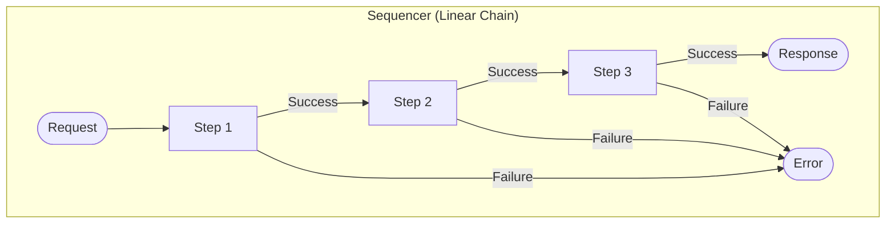

**Code Pattern:**
```java
return step1.apply(input)
    .flatMap(step2::apply)
    .flatMap(step3::apply);
```

---

### Fork-Join Pattern

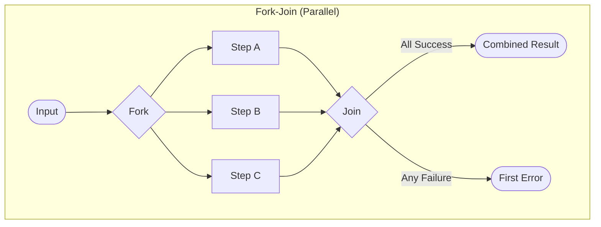

**Code Pattern:**
```java
return Promise.all(stepA.apply(input),
                  stepB.apply(input),
                  stepC.apply(input))
              .map(CombinedResult::new);
```

---

### Condition Pattern

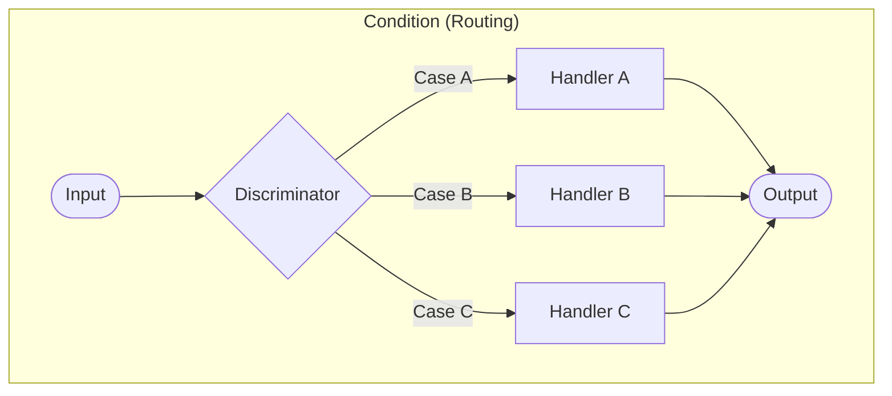

**Code Pattern:**
```java
return switch (input.type()) {
    case TYPE_A -> handlerA.apply(input);
    case TYPE_B -> handlerB.apply(input);
    case TYPE_C -> handlerC.apply(input);
};
```

---

### Iteration Pattern

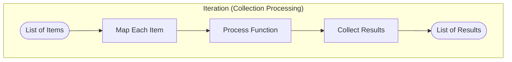

**Code Pattern:**
```java
return Promise.allOf(items.stream()
                          .map(processor::apply)
                          .toList());
```

---

### Aspects Pattern

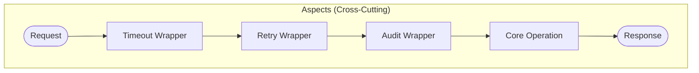

**Code Pattern:**
```java
return withTimeout(
    withRetry(
        withAudit(
            coreOperation.apply(input))));
```

---

### Leaf Pattern

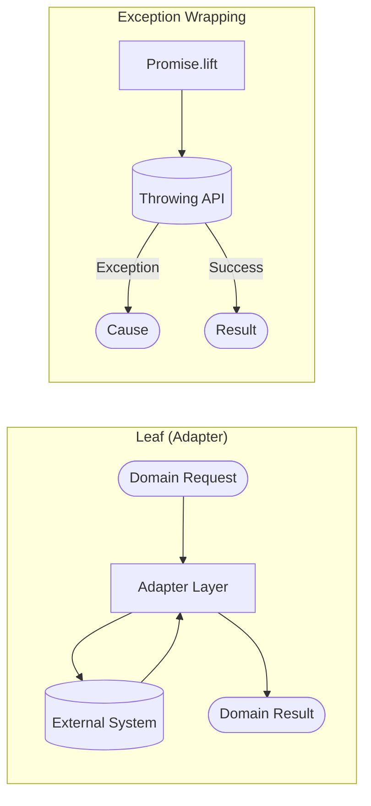

**Code Pattern:**
```java
return Promise.lift(
    DatabaseError::new,
    () -> jdbcTemplate.queryForObject(sql, mapper, params)
);
```

---

## Type Transformation Diagrams

### Type Hierarchy

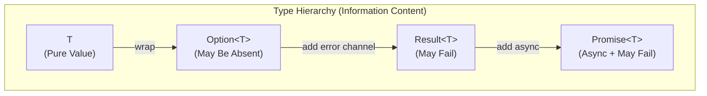

---

### Type Conversions

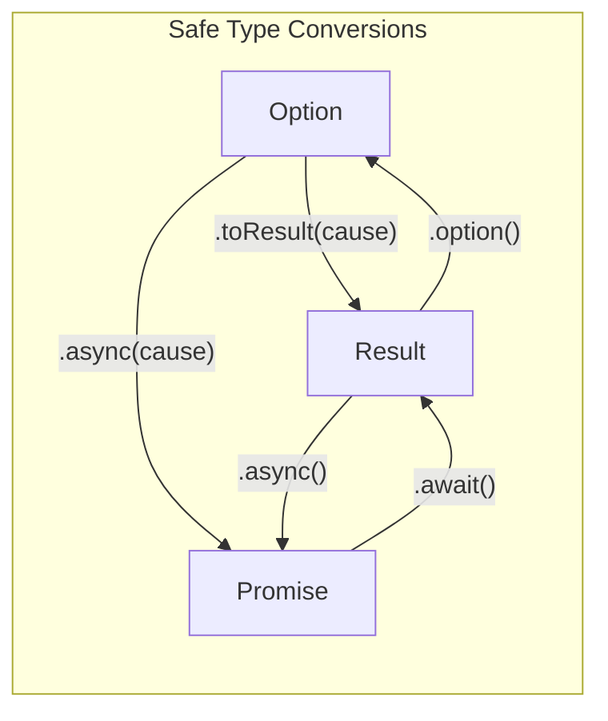

**Lifting (Safe - adds information):**
- `Option` → `Result`: `.toResult(cause)`
- `Option` → `Promise`: `.async(cause)`
- `Result` → `Promise`: `.async()`

**Lowering (Loses information):**
- `Promise` → `Result`: `.await()` (blocks)
- `Result` → `Option`: `.option()` (loses error)

---

### Return Type Decision Tree

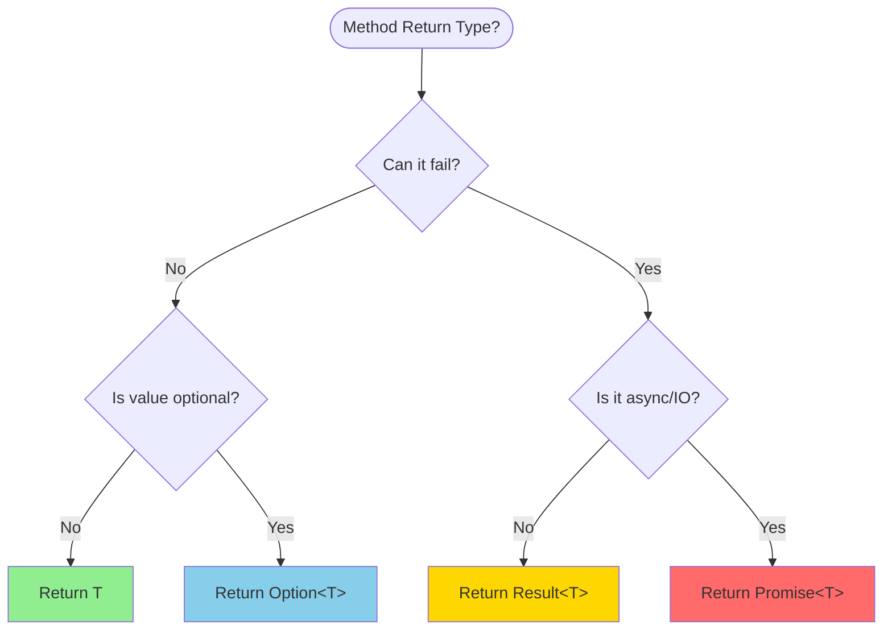

---

## Architecture Diagrams

### Three Zones

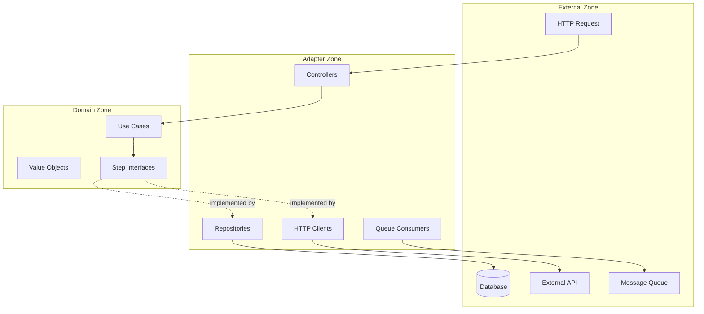

---

### Use Case Structure

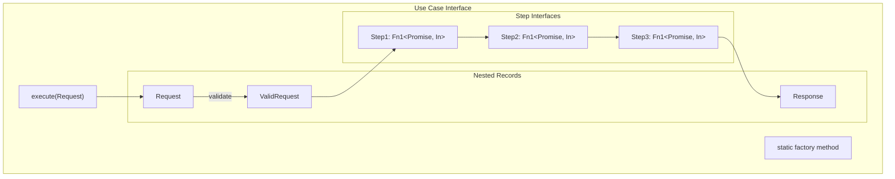

---

### Package Structure

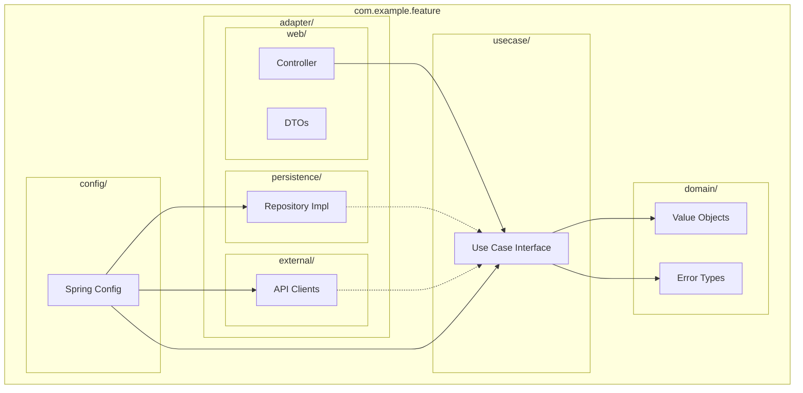

---

## Error Handling Diagrams

### Result Aggregation

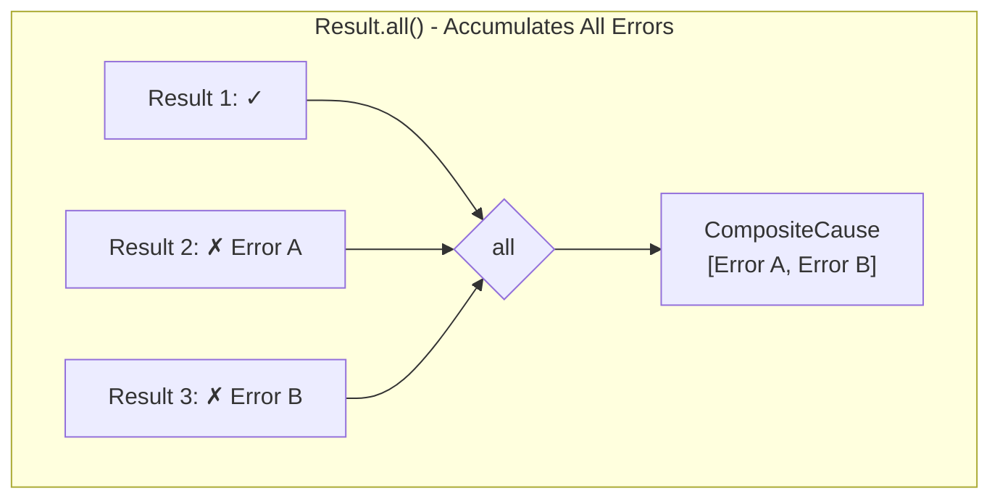

---

### flatMap vs all

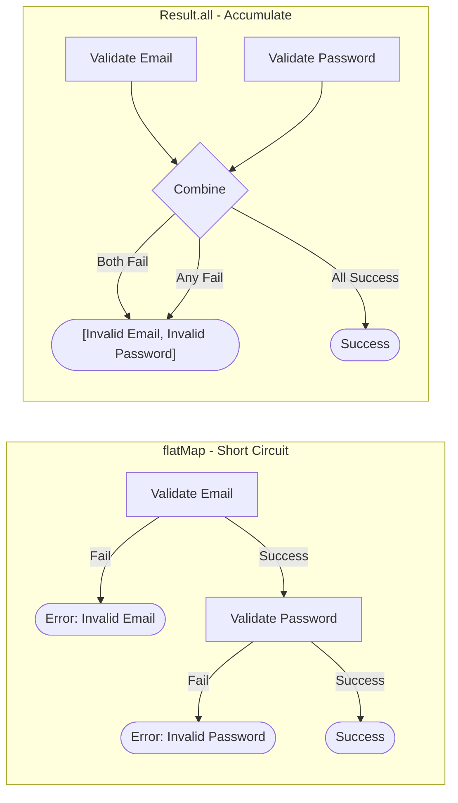

---

### Recovery Pattern

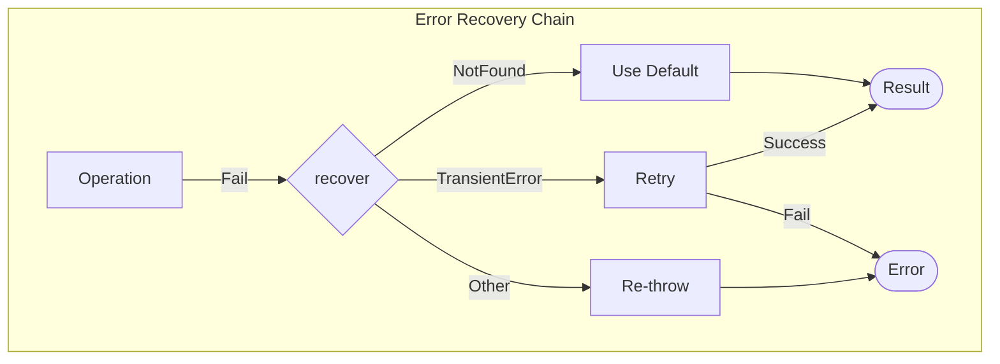

**Code Pattern:**
```java
operation.apply(input)
    .recover(this::handleError);

private Promise<T> handleError(Cause cause) {
    return switch (cause) {
        case TransientError e -> retry(input);
        case NotFound e -> Promise.success(defaultValue);
        default -> cause.promise();
    };
}
```

---

## Testing Diagrams

### Test Structure

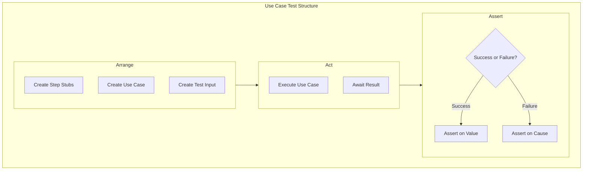

---

### Stub Patterns

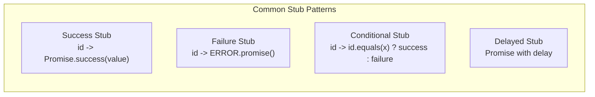

---

## Pattern Selection Decision Tree

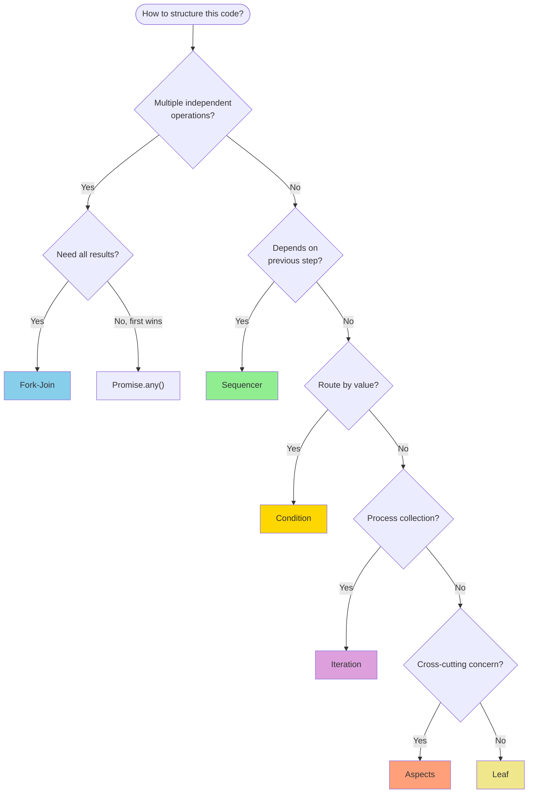

---

## Summary

These diagrams visualize:

| Diagram Type | Purpose |
|--------------|---------|
| Pattern Flows | How data moves through each pattern |
| Type Transformations | Converting between Option/Result/Promise |
| Architecture | Zone boundaries and package structure |
| Error Handling | Aggregation and recovery strategies |
| Testing | Test structure and stub patterns |
| Decision Trees | Choosing return types and patterns |

Use these as reference when designing new code or reviewing existing code against JBCT patterns.
